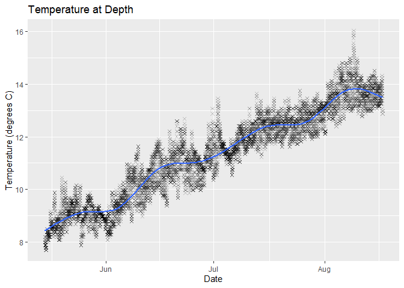

Hobotemp
================

## Hobotemp

This is for managing and understanding your HOBO temperature data

## Requirements

-   [R v4+](https://www.r-project.org/)
-   [dplyr](https://CRAN.R-project.org/package=dplyr)
-   [readr](https://CRAN.R-project.org/package=readr)
-   [stringr](https://CRAN.R-project.org/package=stringr)
-   [ggplot2](https://CRAN.R-project.org/package=ggplot2)

## Installation

    remotes::install_github("rfrancolini/hobotemp")

## Read Example Data

``` r
library(hobotemp)
x <- read_hobotemp()
x
```

    ## # A tibble: 9,169 x 9
    ##    Reading DateTime             Temp Intensity Coupler.detached Coupler.attached
    ##      <dbl> <dttm>              <dbl>     <dbl> <chr>            <chr>           
    ##  1       1 2021-05-14 07:19:00  20.1         1 <NA>             <NA>            
    ##  2       2 2021-05-14 07:19:00  NA          NA Logged           <NA>            
    ##  3       3 2021-05-14 07:34:00  20.5        36 <NA>             <NA>            
    ##  4       4 2021-05-14 07:49:00  20.5        37 <NA>             <NA>            
    ##  5       5 2021-05-14 08:04:00  15.5        26 <NA>             <NA>            
    ##  6       6 2021-05-14 08:19:00  14.0        25 <NA>             <NA>            
    ##  7       7 2021-05-14 08:34:00  14.7        38 <NA>             <NA>            
    ##  8       8 2021-05-14 08:49:00  14.7       123 <NA>             <NA>            
    ##  9       9 2021-05-14 09:04:00  13.9        60 <NA>             <NA>            
    ## 10      10 2021-05-14 09:19:00  15.3        35 <NA>             <NA>            
    ## # ... with 9,159 more rows, and 3 more variables: Host.connected <chr>,
    ## #   Stopped <chr>, End.file <chr>

## Read Example Data with Defined Deploy/Recover Dates

``` r
d <- as.POSIXct("2021-05-15", "")
r <- as.POSIXct("2021-08-16", "")
xdr <- read_hobotemp(deploy = d, recover = r)
xdr
```

    ## # A tibble: 8,928 x 9
    ##    Reading DateTime             Temp Intensity Coupler.detached Coupler.attached
    ##      <dbl> <dttm>              <dbl>     <dbl> <chr>            <chr>           
    ##  1      69 2021-05-15 12:04:00  7.98         0 <NA>             <NA>            
    ##  2      70 2021-05-15 12:19:00  7.88         0 <NA>             <NA>            
    ##  3      71 2021-05-15 12:34:00  7.88         0 <NA>             <NA>            
    ##  4      72 2021-05-15 12:49:00  7.88         0 <NA>             <NA>            
    ##  5      73 2021-05-15 01:04:00  7.78         0 <NA>             <NA>            
    ##  6      74 2021-05-15 01:19:00  7.78         0 <NA>             <NA>            
    ##  7      75 2021-05-15 01:34:00  7.78         0 <NA>             <NA>            
    ##  8      76 2021-05-15 01:49:00  7.78         0 <NA>             <NA>            
    ##  9      77 2021-05-15 02:04:00  7.88         0 <NA>             <NA>            
    ## 10      78 2021-05-15 02:19:00  7.88         0 <NA>             <NA>            
    ## # ... with 8,918 more rows, and 3 more variables: Host.connected <chr>,
    ## #   Stopped <chr>, End.file <chr>

## Draw Example Plot

``` r
tempplot <- draw_plot(xdr)
tempplot
```

    ## `geom_smooth()` using method = 'gam' and formula 'y ~ s(x, bs = "cs")'

<!-- -->
