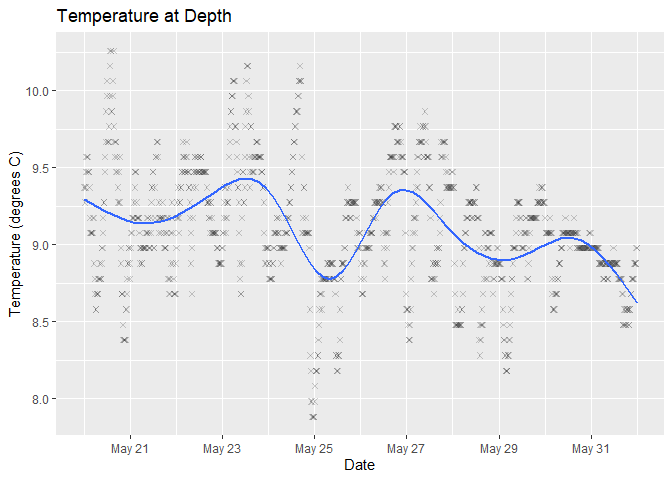
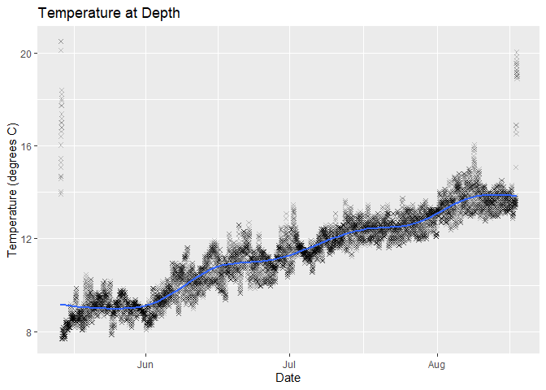

Hobotemp
================

## Hobotemp

This is for managing and understanding your HOBO temperature data

## Requirements

-   [R v4+](https://www.r-project.org/)
-   [dplyr](https://CRAN.R-project.org/package=dplyr)
-   [readr](https://CRAN.R-project.org/package=readr)
-   [stringr](https://CRAN.R-project.org/package=stringr)
-   [ggplot2](https://CRAN.R-project.org/package=ggplot2)

## Installation

    remotes::install_github("rfrancolini/hobotemp")

## Read Example Data

``` r
library(hobotemp)
x <- read_hobotemp()
x
```

    ## # A tibble: 9,025 x 4
    ##    Reading DateTime             Temp Intensity
    ##      <dbl> <dttm>              <dbl>     <dbl>
    ##  1      85 2021-05-15 00:04:32  7.68         0
    ##  2      86 2021-05-15 00:19:32  7.68         0
    ##  3      87 2021-05-15 00:34:32  7.78         0
    ##  4      88 2021-05-15 00:49:32  7.78         0
    ##  5      89 2021-05-15 01:04:32  7.78         2
    ##  6      90 2021-05-15 01:19:32  7.68         9
    ##  7      91 2021-05-15 01:34:32  7.68        20
    ##  8      92 2021-05-15 01:49:32  7.78        37
    ##  9      93 2021-05-15 02:04:32  7.78        69
    ## 10      94 2021-05-15 02:19:32  7.78        57
    ## # ... with 9,015 more rows

## Draw Example Plot

``` r
tempplot_x <- draw_plot(x)
tempplot_x
```

<!-- -->

## Read Example Data With User Defined Start/Stop Dates

``` r
ss <- as.POSIXct(c("2021-05-20", "2021-06-01"), tz = "UTC")
xud <- read_hobotemp(clipped = "user", startstop = ss)
xud
```

    ## # A tibble: 1,152 x 4
    ##    Reading DateTime             Temp Intensity
    ##      <dbl> <dttm>              <dbl>     <dbl>
    ##  1     565 2021-05-20 00:04:32  9.08         0
    ##  2     566 2021-05-20 00:19:32  9.08         0
    ##  3     567 2021-05-20 00:34:32  9.08         0
    ##  4     568 2021-05-20 00:49:32  9.18         0
    ##  5     569 2021-05-20 01:04:32  9.18         0
    ##  6     570 2021-05-20 01:19:32  8.88         0
    ##  7     571 2021-05-20 01:34:32  8.78         0
    ##  8     572 2021-05-20 01:49:32  8.68         0
    ##  9     573 2021-05-20 02:04:32  8.58         0
    ## 10     574 2021-05-20 02:19:32  8.58         0
    ## # ... with 1,142 more rows

## Draw Example Plot User Defined Start/Stop Dates

``` r
tempplot_xud <- draw_plot(xud)
tempplot_xud
```

<!-- -->

## Read Example Data Without Clipping Data

``` r
xna <- read_hobotemp(clipped = "none")
xna
```

    ## # A tibble: 9,169 x 4
    ##    Reading DateTime             Temp Intensity
    ##      <dbl> <dttm>              <dbl>     <dbl>
    ##  1       1 2021-05-14 03:19:32  20.1         1
    ##  2       2 2021-05-14 03:19:59  NA          NA
    ##  3       3 2021-05-14 03:34:32  20.5        36
    ##  4       4 2021-05-14 03:49:32  20.5        37
    ##  5       5 2021-05-14 04:04:32  15.5        26
    ##  6       6 2021-05-14 04:19:32  14.0        25
    ##  7       7 2021-05-14 04:34:32  14.7        38
    ##  8       8 2021-05-14 04:49:32  14.7       123
    ##  9       9 2021-05-14 05:04:32  13.9        60
    ## 10      10 2021-05-14 05:19:32  15.3        35
    ## # ... with 9,159 more rows

## Draw Example Plot Without Clipping Data

``` r
tempplot_na <- draw_plot(xna)
tempplot_na
```

<!-- -->
