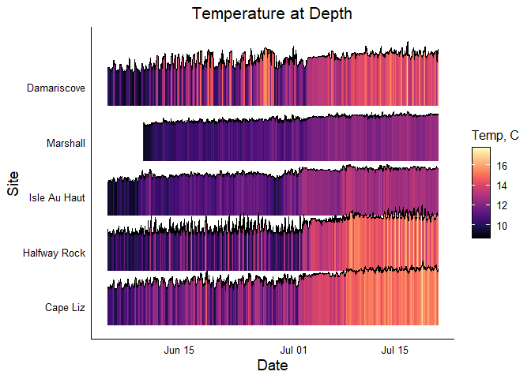
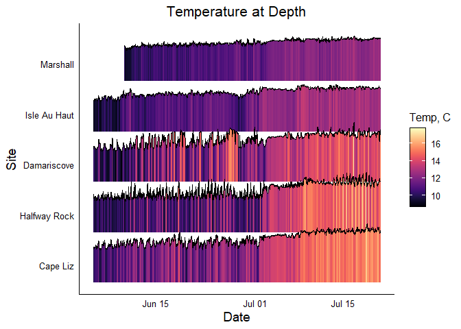

Hobotemp
================

## Hobotemp

This is for managing and understanding your HOBO temperature data. This
will work on any HOBO data that has been downloaded in csv format (not
hproj format).

## Requirements

-   [R v4+](https://www.r-project.org/)
-   [dplyr](https://CRAN.R-project.org/package=dplyr)
-   [readr](https://CRAN.R-project.org/package=readr)
-   [stringr](https://CRAN.R-project.org/package=stringr)
-   [ggplot2](https://CRAN.R-project.org/package=ggplot2)
-   [lubridate](https://CRAN.R-project.org/package=lubridate)

## Installation

    remotes::install_github("rfrancolini/hobotemp")

## Function: read_hobotemp()

This function will take in raw hobotemp data and output a csv. Options
include whether you want to define a site name (if not, itll pull it
from the file name), if you want to define the start/stop times, have it
automatically remove the first and last day (default setting), or keep
all of the data, and if you want to write a file with a specific output
name.

### Read Example Data

``` r
library(hobotemp)
x <- read_hobotemp()
x
```

    ## # A tibble: 9,025 x 5
    ##    Reading DateTime             Temp Intensity Site        
    ##      <int> <dttm>              <dbl>     <dbl> <chr>       
    ##  1      53 2021-05-15 00:04:32  8.18         0 LittleDrisko
    ##  2      54 2021-05-15 00:19:32  8.18         0 LittleDrisko
    ##  3      55 2021-05-15 00:34:32  8.08         0 LittleDrisko
    ##  4      56 2021-05-15 00:49:32  8.18         0 LittleDrisko
    ##  5      57 2021-05-15 01:04:32  8.08         0 LittleDrisko
    ##  6      58 2021-05-15 01:19:32  8.08         0 LittleDrisko
    ##  7      59 2021-05-15 01:34:32  7.98         0 LittleDrisko
    ##  8      60 2021-05-15 01:49:32  7.88         0 LittleDrisko
    ##  9      61 2021-05-15 02:04:32  7.88         0 LittleDrisko
    ## 10      62 2021-05-15 02:19:32  7.88         0 LittleDrisko
    ## # ... with 9,015 more rows

### Read Example Data with User Defined Site

``` r
library(hobotemp)
x <- read_hobotemp(site = "Little Drisko Island")
x
```

    ## # A tibble: 9,025 x 5
    ##    Reading DateTime             Temp Intensity Site                
    ##      <int> <dttm>              <dbl>     <dbl> <chr>               
    ##  1      53 2021-05-15 00:04:32  8.18         0 Little Drisko Island
    ##  2      54 2021-05-15 00:19:32  8.18         0 Little Drisko Island
    ##  3      55 2021-05-15 00:34:32  8.08         0 Little Drisko Island
    ##  4      56 2021-05-15 00:49:32  8.18         0 Little Drisko Island
    ##  5      57 2021-05-15 01:04:32  8.08         0 Little Drisko Island
    ##  6      58 2021-05-15 01:19:32  8.08         0 Little Drisko Island
    ##  7      59 2021-05-15 01:34:32  7.98         0 Little Drisko Island
    ##  8      60 2021-05-15 01:49:32  7.88         0 Little Drisko Island
    ##  9      61 2021-05-15 02:04:32  7.88         0 Little Drisko Island
    ## 10      62 2021-05-15 02:19:32  7.88         0 Little Drisko Island
    ## # ... with 9,015 more rows

### Read Example Data With User Defined Start/Stop Dates

``` r
ss <- as.POSIXct(c("2021-05-20", "2021-06-01"), tz = "UTC")
xud <- read_hobotemp(clipped = "user", startstop = ss)
xud
```

    ## # A tibble: 1,152 x 5
    ##    Reading DateTime             Temp Intensity Site        
    ##      <int> <dttm>              <dbl>     <dbl> <chr>       
    ##  1     533 2021-05-20 00:04:32  8.38         0 LittleDrisko
    ##  2     534 2021-05-20 00:19:32  8.48         0 LittleDrisko
    ##  3     535 2021-05-20 00:34:32  8.48         0 LittleDrisko
    ##  4     536 2021-05-20 00:49:32  8.48         0 LittleDrisko
    ##  5     537 2021-05-20 01:04:32  8.58         0 LittleDrisko
    ##  6     538 2021-05-20 01:19:32  8.58         0 LittleDrisko
    ##  7     539 2021-05-20 01:34:32  8.68         0 LittleDrisko
    ##  8     540 2021-05-20 01:49:32  8.68         0 LittleDrisko
    ##  9     541 2021-05-20 02:04:32  8.78         0 LittleDrisko
    ## 10     542 2021-05-20 02:19:32  8.78         0 LittleDrisko
    ## # ... with 1,142 more rows

## Function: summarize_hobotemp()

Create a dataframe summarizing the temperature data, will group by site.

### Summarize data, csv with one site

``` r
sum1 <- summarize_hobotemp(x)
print.data.frame(sum1)
```

    ##                   Site mean.temp           first.day            last.day
    ## 1 Little Drisko Island  11.30466 2021-05-15 00:04:32 2021-08-17 00:04:32
    ##   max.temp       max.temp.date min.temp       min.temp.date
    ## 1   16.046 2021-08-08 22:34:32    7.682 2021-05-15 07:34:32

### Summarize data, csv with more than one site

``` r
sum2 <- summarize_hobotemp(example_ridge_data())
```

    ## Rows: 26018 Columns: 5

    ## -- Column specification --------------------------------------------------------
    ## Delimiter: ","
    ## chr  (1): Site
    ## dbl  (3): Reading, Temp, Intensity
    ## dttm (1): DateTime

    ## 
    ## i Use `spec()` to retrieve the full column specification for this data.
    ## i Specify the column types or set `show_col_types = FALSE` to quiet this message.

``` r
print.data.frame(sum2)
```

    ##           Site mean.temp           first.day            last.day max.temp
    ## 1     Cape Liz  12.95992 2021-06-05 00:11:44 2021-07-20 23:56:44   17.379
    ## 2  Damariscove  12.58830 2021-06-05 00:04:55 2021-07-20 23:49:55   17.475
    ## 3 Halfway Rock  12.35469 2021-06-05 00:14:09 2021-07-20 23:59:09   17.760
    ## 4 Isle Au Haut  11.61809 2021-06-05 00:00:00 2021-07-21 00:00:00   13.846
    ## 5     Marshall  11.38961 2021-06-10 00:00:00 2021-07-21 00:00:00   13.269
    ##         max.temp.date min.temp       min.temp.date
    ## 1 2021-07-18 20:41:44    9.571 2021-06-21 09:56:44
    ## 2 2021-07-16 19:04:55    8.680 2021-06-09 12:49:55
    ## 3 2021-07-18 18:14:09    9.077 2021-06-18 09:59:09
    ## 4 2021-07-08 10:00:00    8.779 2021-06-08 07:00:00
    ## 5 2021-07-16 18:45:00    9.077 2021-06-10 05:15:00

## Function: draw_scatter_plot()

This function will read in a csv of your HOBO data and draw a scatter
plot with an overlapping trendline.

### Draw Example Scatter Plot

``` r
tempplot_x <- draw_scatter_plot(x)
tempplot_x
```

<!-- -->

### Draw Example Scatter Plot with User Defined Start/Stop Dates and Title

``` r
tempplot_xud <- draw_scatter_plot(xud, main = "Temperature at Depth, End of May")
tempplot_xud
```

<!-- -->

## Function: draw_ridgeline_plot()

This function will create a color-coded ridgeline plot, adapted from
[here](https://r-graph-gallery.com/294-basic-ridgeline-plot.html). This
will have a line representing the temperature, as well as the space
underneath the line colored in using a temperature gradient color
scheme. Sites will appear in order they are in dataframe, unless
“ordered” option is used.

### Draw example ridgeline plot

``` r
ridgelineplot <- draw_ridgeline_plot()
ridgelineplot
```

<!-- -->

### Draw example ridgeline plot with specified site order (south to north)

``` r
SiteOrder <-  c("Cape Liz", "Halfway Rock", "Damariscove", "Isle Au Haut", "Marshall")
ridgelineplotO <- draw_ridgeline_plot(ordered = SiteOrder)
ridgelineplotO
```

<!-- -->
